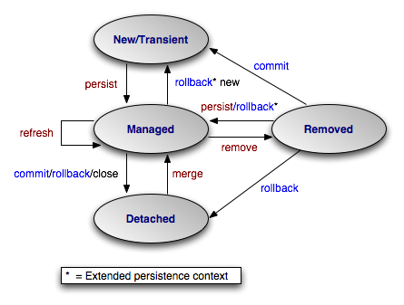

Here are SpringData JPA experience .
{: .fs-6 .fw-300 }


## Table of contents
{: .no_toc .text-delta }


## 一、JPA 是什么

### 1、基本介绍


JPA（Java Persistence API，Java持久化API），**定义了对象-关系映射（ORM）以及实体对象持久化的标准接口**。

JPA是JSR-220（EJB3.0）规范的一部分，在JSR-220中规定实体对象（EntityBean）由JPA进行支持。

JPA不局限于EJB3.0，而是作为POJO持久化的标准规范，可以脱离容器独立运行，开发和测试更加方便。


JPA维护一个Persistence Context（持久化上下文），在持久化上下文中维护实体的生命周期。主要包含三个方面的内容：

 - ORM映射元数据, JPA支持 **annotion** 或 **xml** 两种形式描述对象-关系映射。
 - 操作实体对象的API, 实现对面向对象的方式对数据库进行CRUD操作。
 - 查询语言，约定了面向对象的查询语言JPQL（Java Persistence Query Language）。

> JPA仅仅是一种规范，只定义了一些接口，接口必须需要实现才能工作运行。

核心依赖组件：

```xml
    <dependency>
    	<groupId>javax.persistence</groupId>
    	<artifactId>javax.persistence-api</artifactId>
    	<version>2.2</version>
    </dependency>
```

Hibernate 与 JPA 

JPA是一套ORM规范，Hibernate 实现了JPA规范。也有其他实现，如openJPA、eclipseLink等。


JPA的主要API都定义在javax.persistence包中。

| org.hibernate	| javax.persistence	 | 作用说明 |
|---------------|--------------------|---------|
|cfg.Configuration	|Persistence	| 读取配置信息
|SessionFactory	|EntityManagerFactory	| 用于创建会话/实体管理器的工厂类
|Session	| EntityManager	| 提供实体操作API，管理事务，创建查询
|Transaction	| EntityTransaction	| 管理事务
|Query	| Query	| 执行查询


LocalEntityManagerFactoryBean：

程序管理型：实体管理器是在程序直接向实体管理器工厂请求一个实体管理器时创建的。在这种情况下，程序负责打开或关闭实体管理器，并且在事务中控制管理器。这种类型最适合不运行于Java EE容器的独立程序。


LocalContainerEntityManagerFactoryBean：

容器管理型：实体管理器由Java EE容器创建和管理。这种情况下，程序根本不与实体管理器工厂进行交互，实体管理器是通过注入或利用JNDI直接获得的，容器负责配置实体管理器工厂。这种类型最适合希望不考虑persistence.xml中的特殊性而在JPA配置之上维持某种控制的Java EE容器。


## 2、实体生命周期

实体生命周期是JPA中非常重要的概念，描述了实体对象从创建到受控、从删除到游离的状态变换。

对实体的操作主要就是改变实体的状态，

实体4种状态

 - 临时状态：刚创建出来，还没有与entityManager发生关系，没有被持久化，不处于entityManager中的对象。
 - 持久状态：与entityManager发生关系，已经被持久化，您可以把持久化状态当做实实在在的数据库记录。
 - 删除状态：执行remove方法，事物提交之前。
 - 游离状态：游离状态就是提交到数据库后，事务commit后实体的状态，因为事务已经提交了，此时实体的属性任你如何改变，也不会同步到数据库，不在持久化上下文中。

JPA中实体的生命周期如下图：

  -  New，对应**临时状态**。新创建的实体对象，没有主键(identity)值
  -  Managed，对应**持久状态**。对象处于Persistence Context(持久化上下文）中，被EntityManager管理。
  -  Detached，对应**游离状态**。对象已经游离到Persistence Context之外，进入Application Domain。
  -  Removed, 对应**删除状态**。实体对象被删除




EntityManager提供一系列的方法管理实体对象的生命周期，包括：

public void persist(Object entity)

 - persist方法可以将新创建的或已删除的实体转变为Managed托管状态，在调用flush方法或提交事务后，实例数据会持久化存入数据库。
 
>对于不同状态的实体 E 执行persist会产生以下操作：
>    - 1.如果E是是一个new状态的实体，它将会转为managed状态;
>    - 2.如果E是一个managed状态的实体，它的状态不会发生任何改变。但是系统仍会在数据库执行INSERT操作;
>    - 3.如果E是一个removed（删除）状态的实体，它将会转换为受控状态;
>    - 4.如果E是一个detached（游离）状态的实体，该方法会抛出IllegalArgumentException异常，具体异常根据不同的JPA实现有关。

public void merge(Object entity)

 - merge，将游离实体转变为Managed状态，数据存入数据库。

>对于不同状态的实体 E 执行merge会产生以下操作：
>    - 1.如果E是一个detached状态的实体，该方法会将E的修改提交到数据库，并返回一个新的managed状态的实例E2;
>    - 2.如果E是一个new状态的实体，该方法会产生一个根据E产生的managed状态实体E2;
>    - 3.如果E是一个managed状态的实体，它的状态不会发生任何改变。但是系统仍会在数据库执行UPDATE操作;
>    - 4.如果E是一个removed状态的实体，该方法会抛出IllegalArgumentException异常。

public void refresh(Object entity)

 - refresh方法可以保证当前的实例与数据库中的实例的内容一致。
 
>对不同状态下的实例E执行refresh会产生以下操作：
>1.如果E是一个new状态的实例，不会发生任何操作，但有可能会抛出异常，具体情况根据不同JPA实现有关；
>2.如果E是一个managed状态的实例，它的属性将会和数据库中的数据同步：

public void remove(Object entity)

 - remove方法可以将实体转换为removed状态，并且在调用flush方法或提交事物后删除数据库中的数据。

>对不同状态下的实例E执行remove会产生以下操作：
>    - 1.如果E是一个new状态的实例，E的状态不会发生任何改变，但系统仍会在数据库中执行DELETE语句：
>    - 2.如果E是一个managed状态的实例，它的状态会转换为removed；
>    - 3.如果E提一个removed状态的实例，不会发生任何操作；
>    - 4.如果E是一个detached状态的实体，该方法将会抛出异常。


 
如果使用了事务管理，则事务的commit/rollback也会改变实体的状态，详见JPA中实体的生命周期的图。


JPA/Hibernate缓存: 
 - 一级缓存： EntityManager
 - 二级缓存： 应用级缓存


## 2、ORM映射

### 2.1 映射常用注解

**@Entity**

 - 标注用于实体类声明语句之前，指出该Java 类为实体类，将映射到指定的数据库表。如声明一个实体类 Customer，它将映射到数据库中的 customer 表上。
 
**@Table**

 - 当实体类与其映射的数据库表名不同名时需要使用 @Table 标注说明，该标注与 @Entity 标注并列使用，置于实体类声明语句之前，可写于单独语句行，也可与声明语句同行。
 - Table 标注的常用选项是 name，用于指明数据库的表名
 - Table标注还有一个两个选项 catalog 和 schema 用于设置表所属的数据库目录或模式，通常为数据库名。uniqueConstraints 选项用于设置约束条件，通常不须设置。

**@Id**

   - Id 标注用于声明一个实体类的属性映射为数据库的主键列。该属性通常置于属性声明语句之前，可与声明语句同行，也可写在单独行上。
   - Id标注也可置于属性的getter方法之前。
 
**@GeneratedValue**（不填，默认auto）

   - GeneratedValue  用于标注主键的生成策略，通过 strategy 属性指定。默认情况下，JPA 自动选择一个最适合底层数据库的主键生成策略：SqlServer 对应 identity，MySQL 对应 auto increment。
   - 在 javax.persistence.GenerationType 中定义了以下几种可供选择的策略： 
      - IDENTITY：采用数据库 ID自增长的方式来自增主键字段，Oracle 不支持这种方式；
      - AUTO： JPA自动选择合适的策略，是默认选项；
      - SEQUENCE：通过序列产生主键，通过 @SequenceGenerator 注解指定序列名，MySql 不支持这种方式
      - TABLE：通过表产生主键，框架借由表模拟序列产生主键，使用该策略可以使应用更易于数据库移植。
 
**@Column**

 - 当实体的属性与其映射的数据库表的列不同名时需要使用@Column 标注说明，该属性通常置于实体的属性声明语句之前，还可与 @Id 标注一起使用。
 - Column 标注的常用属性是 name，用于设置映射数据库表的列名。此外，该标注还包含其它多个属性，如：unique 、nullable、length 等。
 - Column 标注的 columnDefinition 属性: 表示该字段在数据库中的实际类型.通常 ORM 框架可以根据属性类型自动判断数据库中字段的类型,但是对于Date类型仍无法确定数据库中字段类型究竟是DATE,TIME还是TIMESTAMP.此外,String的默认映射类型为VARCHAR, 如果要将 String 类型映射到特定数据库的 BLOB 或TEXT 字段类型.
 - Column标注也可置于属性的getter方法之前
 
**@Basic**(未加注解的默认注解)
 - Basic 表示一个简单的属性到数据库表的字段的映射,对于没有任何标注的 getXxxx() 方法,默认即为@Basic
 - fetch: 表示该属性的读取策略,有 EAGER 和 LAZY 两种,分别表示主支抓取和延迟加载,默认为 EAGER.
 - optional:表示该属性是否允许为null, 默认为true

**@Transient**

  - 表示该属性并非一个到数据库表的字段的映射,ORM框架将忽略该属性.
  - 如果一个属性并非数据库表的字段映射,就务必将其标示为@Transient,否则,ORM框架默认其注解为@Basic
    
**@Temporal**    
  
  - 在核心的 Java API 中并没有定义 Date 类型的精度(temporal precision). 而在数据库中,表示 Date 类型的数据有 DATE, TIME, 和 TIMESTAMP 三种精度(即单纯的日期,时间,或者两者 兼备). 在进行属性映射时可使用@Temporal注解来调整精度.

  
demo :

```java
package com.small.rose.demo.module.hibernate.entities;

import lombok.Data;

import javax.persistence.Column;
import javax.persistence.Entity;
import javax.persistence.GeneratedValue;
import javax.persistence.GenerationType;
import javax.persistence.Id;
import javax.persistence.SequenceGenerator;
import javax.persistence.Table;
import javax.persistence.Temporal;
import javax.persistence.TemporalType;
import javax.persistence.Transient;

@Data
@Entity
@Table(name = "T_INVENTORY")
public class Tinventory {

    @Id
    @Column(name = "ID")
    @GeneratedValue(strategy = GenerationType.SEQUENCE, generator = "SEQUENCE")
    @SequenceGenerator(name = "SEQUENCE", sequenceName = "SEQ_INVENTORY", allocationSize = 1)
    private Long id ;

    @Column(name = "SHOP_NO")
    private String shopNo ;

    @Column(name = "SHOP_NAME")
    private String shopName ;

    @Column(name = "SHOP_NUMBER")
    private Long shopNumber ;

    @Column(name = "SHOP_STATUS")
    private String shopStatus ;

    @Column(name = "CREATETIME")
    @Temporal(TemporalType.TIMESTAMP)
    private Date createtime ;

    @Column(name = "LASTOPDATE")
    @Temporal(TemporalType.TIMESTAMP)
    private Date lastopdate ;
    
    @Transient
    private String elseproperty ;


    @Override
    public String toString() {
        return "Tinventory{" +
                "id=" + id +
                ", shopNo='" + shopNo + '\'' +
                ", shopName='" + shopName + '\'' +
                ", shopNumber=" + shopNumber +
                ", shopStatus='" + shopStatus + '\'' +
                ", createtime=" + createtime +
                ", lastopdate=" + lastopdate +
                '}';
    }
}
```    

### 2.2 ID生成策略

ID对应数据库表的主键，是保证唯一性的重要属性。JPA提供了以下几种ID生成策略

   - GeneratorType.AUTO ，由JPA自动生成
   - GenerationType.IDENTITY，使用数据库的自增长字段，需要数据库的支持（如SQL Server、MySQL、DB2、Derby等）
   - GenerationType.SEQUENCE，使用数据库的序列号，需要数据库的支持（如Oracle）
   - GenerationType.TABLE，使用指定的数据库表记录ID的增长 需要定义一个TableGenerator，在@GeneratedValue中引用。例如：

    @TableGenerator( name="myGenerator", table="GENERATORTABLE", pkColumnName = "ENTITYNAME", pkColumnValue="MyEntity", valueColumnName = "PKVALUE", allocationSize=1 )
    @GeneratedValue(strategy = GenerationType.TABLE,generator="myGenerator")


### 2.3 关联关系

JPA定义了one-to-one、one-to-many、many-to-one、many-to-many 4种关系。

对于数据库来说，通常在一个表中记录对另一个表的外键关联；对应到实体对象，持有关联数据的一方称为owning-side，另一方称为inverse-side。

为了编程的方便，我们经常会希望在inverse-side也能引用到owning-side的对象，此时就构建了双向关联关系。 在双向关联中，需要在inverse-side定义mappedBy属性，以指明在owning-side是哪一个属性持有的关联数据。

对关联关系映射的要点如下：

|关系类型	| Owning-Side	| Inverse-Side |
|-----------|---------------|--------------|
|one-to-one	| @OneToOne |	@OneToOne(mappedBy="othersideName") |
|one-to-many / many-to-one | 	@ManyToOne	| @OneToMany(mappedBy="xxx") |
|many-to-many	| @ManyToMany	| @ManyToMany(mappedBy ="xxx") |

其中 many-to-many关系的owning-side可以使用@JoinTable声明自定义关联表，比如Book和Author之间的关联表：

@JoinTable(name = "BOOKAUTHOR", joinColumns = { @JoinColumn(name = "BOOKID", referencedColumnName = "id") }, inverseJoinColumns = { @JoinColumn(name = "AUTHORID", referencedColumnName = "id") })

关联关系还可以定制延迟加载和级联操作的行为（owning-side和inverse-side可以分别设置）：

通过设置fetch=FetchType.LAZY 或 fetch=FetchType.EAGER来决定关联对象是延迟加载或立即加载。

通过设置cascade={options}可以设置级联操作的行为，其中options可以是以下组合：

    CascadeType.MERGE 级联更新
    CascadeType.PERSIST 级联保存
    CascadeType.REFRESH 级联刷新
    CascadeType.REMOVE 级联删除
    CascadeType.ALL 级联上述4种操作


### 2.4 继承关系

JPA通过在父类增加@Inheritance(strategy=InheritanceType.xxx)来声明继承关系。JPA支持3种继承策略：

  - 单表继承（InheritanceType.SINGLETABLE），所有继承树上的类共用一张表，在父类指定（@DiscriminatorColumn）声明并在每个类指定@DiscriminatorValue来区分类型。
  - 类表继承（InheritanceType.JOINED），父子类共同的部分公用一张表，其余部分保存到各自的表，通过join进行关联。
  - 具体表继承（InheritanceType.TABLEPERCLASS)，每个具体类映射到自己的表。

其中1和2能够支持多态，但是1需要允许字段为NULL，2需要多个JOIN关系；3最适合关系数据库，对多态支持不好。具体应用时根据需要取舍。

### 3 事件及监听


通过在实体的方法上标注@PrePersist，@PostPersist等声明即可在事件发生时触发这些方法。


## 4 查询规范


JPA提供两种查询方式，一种是根据主键查询，使用EntityManager的find方法：

```
T find(Class entityClass, Object primaryKey)
```

另一种就是使用JPQL查询语言。JPQL是完全面向对象的，具备继承、多态和关联等特性，和hibernate HQL很相似。

使用EntityManager的createQuery方法：

```
Query createQuery(String qlString)
```

### 4.1 JPQL 查询参数

可以在JPQL语句中使用参数。JPQL支持命名参数和位置参数两种参数，但是在一条JPQL语句中所有的参数只能使用同一种类型。

举例如下：

命令参数
```
Query query = em.createQuery("select p from Person p where p.personid=:Id"); 
query.setParameter("Id",new Integer(1));
```
位置参数
```
Query query = em.createQuery("select p from Person p where p.personid=?1"); 
query.setParameter(1,new Integer(1));
```

### 4.2 命名查询

如果某个JPQL语句需要在多个地方使用，还可以使用@NamedQuery 或者 @NamedQueries在实体对象上预定义命名查询。

在需要调用的地方只要引用该查询的名字即可。

例如：
```
@NamedQuery(name="getPerson", query= "FROM Person WHERE personid=?1")

@NamedQueries({ 
    @NamedQuery(name="getPerson1", query= "FROM Person WHERE personid=?1"), 
    @NamedQuery(name="getPersonList", query= "FROM Person WHERE age>?1") 
})

Query query = em.createNamedQuery("getPerson");
```
### 4.3  排序

JPQL也支持排序，类似于SQL中的语法。例如： 
```
Query query = em.createQuery("select p from Person p order by p.age, p.birthday desc");
```

### 4.4 聚合查询

JPQL支持AVG、SUM、COUNT、MAX、MIN五个聚合函数。例如：
```
Query query = em.createQuery("select max(p.age) from Person p"); 
Object result = query.getSingleResult(); 
String maxAge = result.toString();
```

### 4.5 更新和删除

JPQL不仅用于查询，还可以用于批量更新和删除。

如：
```
Query query = em.createQuery("update Order as o set o.amount=o.amount+10"); 
//update 的记录数 
int result = query.executeUpdate();

Query query = em.createQuery("delete from OrderItem item where item.order in(from Order as o where o.amount<100)"); 
query.executeUpdate();

query = em.createQuery("delete from Order as o where o.amount<100"); 
query.executeUpdate();//delete的记录数
```


### 4.6 自定义查询 

(1 )JPQL 

使用 @Query注解 **面向对象** 查询。

 - 索引传参模式:  ?数字, 传参位置对齐
 - 具名参数模式，使用@Param注解绑定参数名

JPQL 增删改操作需要事务支持@Transactional (一般在业务层) ，并且需要添加 @Modifying 注解通知springdatajpa是增删改的操作。

JPQL 不支持插入，如果是插入操作，一定是在hibernate的下菜支持，可借助 insert into select 方式进行。

```java
public interface CustomerRepository extends PagingAndSortingRepository<Customer,Long>{
     
    // 索引传参模式:  ?数字, 传参位置对齐
    @Query("FROM Customer where custName=?1 ")
    List<Customer>findCustomerByCustName(String custName);

    // 具名参数模式，使用@Param注解绑定参数名
    @Query("FROM Customer where custName=:custName ")
    List<Customer>findCustomerByCustName(@Param("custName") String custName);
    //修改
    @Transactional
    @Modifying
    @Query("UPDATE Customer c set c.custName=:custName where c.custId=:id")
    int updateCustomer(@Param("custName")String custName, @Param("id")Long id);
    
    @Transactional
    @Modifying 
    @Query("DELETE FROM Customer where c.custId=:id")
    int deleteCustomer(Long id);

    //新增
    @Transactional
    @Modifying
    @Query("INSERT INTO Customer (custName ) SELECT c.custName FROM Customer C where c.custId = ?1 ")
    int insertCustomerBySelect(Long id);

    // 原始SQL 查询
    @Query(value="select * from tb_customer where cust_name=:custName",nativeQuery = true)
    List<Customer> findCustomerByCustNameBySql(@Param("custName") String custName);

}
```

> jpa buddy 的idea插件可以提示JPQL对象属性

(2) 约定方法名

支持查询方法的主题关键字（方法前缀）
 - 决定当前方法的作用
 - 只支持查询和删除
 
支持查询方法的谓词关键字和修饰符
 - 决定查询条件的

具体可参考官网对应版本支持[jpa/reference/jpa/query-methods](https://docs.spring.io/spring-data/jpa/reference/jpa/query-methods.html)

(3) Query By Example 举例查询

查询限制

 - 不支持嵌套或分组的属性约束，如 a=?1 or ( b =?2 and c =?3 )
 - 只支持字符串 start、contains、ends、regex 匹配和其他属性类型的精确匹配。

关键接口 QueryByExampleExecutor

```java
public interface QueryByExampleExecutor<T> {

  <S extends T> S findOne(Example<S> example);

  <S extends T> Iterable<S> findAll(Example<S> example);

  // … more functionality omitted.
}
```

Example 简单匹配模式：

```
Person person = new Person();                         
person.setFirstname("Dave");                          

Example<Person> example = Example.of(person);   
```

ExampleMatcher 复杂匹配模式：

```
//创建域对象的新实例。
Person person = new Person();                          
person.setFirstname("Dave");                           
//创建一个ExampleMatcher以期望所有值都匹配。
ExampleMatcher matcher = ExampleMatcher.matching()     
    //构造一个新的ExampleMatcher以忽略lastname属性路径
    .withIgnorePaths("lastname")          
     //构造一个新的ExampleMatcher以忽略lastname属性路径并包含 null 值               
    .withIncludeNullValues()                        
    //构造一个新的ExampleMatcher以忽略lastname属性路径、包含空值并执行后缀字符串匹配。     
    .withStringMatcher(StringMatcher.ENDING);            

Example<Person> example = Example.of(person, matcher); 
```
ExampleMatcher希望探针上设置的所有值都匹配。如果您想获得与隐式定义的任何谓词匹配的结果，请使用ExampleMatcher.matchingAny() 。

更多参考官方示例[reference/repositories/query-by-example](https://docs.spring.io/spring-data/jpa/reference/repositories/query-by-example.html)


(4) Specifications 规格查询

> JPA 2 引入了一个标准 API，您可以使用它以编程方式构建查询。通过编写criteria ，您可以定义域类查询的 where 子句。退后一步，这些标准可以被视为对 JPA 标准 API 约束所描述的实体的谓词。

>  规约模式（Specification Pattern）是一种特殊的设计模式，最早由Eric Evans在他的《领域驱动设计》一书中提出。规约模式的主要思想是将业务规则从业务对象中分离出来，这样就可以将这些规则独立地重用和组合。一个规约（Specification）是一个独立的业务规则，它通常会实现一个方法（在Java中通常是isSatisfiedBy），该方法接收一个业务对象，然后检查这个对象是否满足规约的条件。


规范接口 JpaSpecificationExecutor

定义规格规则， 也可以在查询的时候临时创建匿名类

```java
public class CustomerSpecs {


  public static Specification<Customer> isLongTermCustomer() {
    return (root, query, builder) -> {
       // root 是 from Customer 为了可以获取实体列
       // query 组装 order by  where  
       // builder 组合where 条件
      LocalDate date = LocalDate.now().minusYears(2);
      return builder.lessThan(root.get(Customer_.createdAt), date);
    };
  }

  public static Specification<Customer> hasSalesOfMoreThan(MonetaryAmount value) {
    return (root, query, builder) -> {
      // build query here
    };
  }
}
```


```java
public class CustomerSpecs {
    
    @Test
    public void SpecificationTest(){
        List<Customer> customers = customerRepository.findAll(isLongTermCustomer());
        
        
        List<Customer> customers = customerRepository.findAll((root, query, builder) -> {
              LocalDate date = LocalDate.now().minusYears(2);
              return builder.lessThan(root.get(Customer_.createdAt), date);
        });
        
        //第二个参数：排序的属性名称
        Sort sort =   Sort.by(Sort.Direction.DESC,"custId");
        
        List<Customer> customers = customerRepository.findAll(new Specification<Customer>() {
                    @Override
                    public Predicate toPredicate(Root<Customer> root, CriteriaQuery<?> query, CriteriaBuilder criteriaBuilder) {
        
                        Path<Long> custId = root.get("custId");
                        Path<String> custName = root.get("custName");
                        Path<String> custStatus = root.get("custStatus");
                        Path<Date> opdate = root.get("opdate");
        
                        List<Predicate> list = new ArrayList<>();
                        // 传1id 就使用ID查
                        if (!ObjectUtils.isEmpty(customer.getCustId())){
                            list.add(criteriaBuilder.equal(custId, customer.getCustId()));
                        }
                        if (!ObjectUtils.isEmpty(customer.getCustName())) {
                            list.add(criteriaBuilder.like(custName.as(String.class), "%"+customer.getCustName()+"%"));
                        }
        
                        if (!ObjectUtils.isEmpty(customer.getStatus())) {
                            CriteriaBuilder.In<String> in = criteriaBuilder.in(custStatus);
                            in.value("01").value("02");
                            list.add(in);
                        }
                        if (!ObjectUtils.isEmpty(customer.getOpDate())) {
                            list.add(criteriaBuilder.greaterThan(opdate.as(LocalDate.class),  LocalDate.now().minusYears(1)));
                        }
        
                        Predicate and = criteriaBuilder.and(list.toArray(new Predicate[list.size()]));
        
                        return and;
                    }
                }, sort);

    }
}
```

{.tips}
> 看到这里，一定可以发现这特么什么东西，搞个SQL还这么复杂，说明可读性相对较差，尤其是初接触的时候，只能说复杂业务最好不要使用了这个匿名的Specification查询，一定是相对简单查询才使用，否则可以预见以后维护SQL非常痛苦。
> 如果一定要用，尽量预期业务查询变动小，或者定义一个归约实现类，拆解出更细致粒度的归约条件，然后直接进行细粒度的归约组合。
> 我记得 Mybatis 也有这种类似归约式的查询，不过它是使用的Example类命名，整体的设计条件组合和这个 Specification 风格挺相似。 


(5) QueryDSL 查询

[http://querydsl.com/](http://querydsl.com/)

**不属于JPA规范或Hibernate框架，而是第三方独立组件。**

Querydsl 定义了一种通用的静态类型语法，用于在持久域模型数据之上进行查询。 JDO 和 JPA 是 Querydsl 的主要集成技术。 本指南介绍了如何将 Querydsl 与 JPA 结合使用。

Querydsl for JPA 是 JPQL 和 Criteria 查询的替代方案。 它以完全类型安全的方式将 Criteria 查询的动态特性与 JPQL 的表达能力以及所有这些结合起来。

直接看文档[https://github.com/querydsl/querydsl/tree/master/querydsl-jpa](https://github.com/querydsl/querydsl/tree/master/querydsl-jpa)

Querydsl JPA 模块支持 JPA 和 Hibernate API。

```xml
<dependency>
  <groupId>com.querydsl</groupId>
  <artifactId>querydsl-apt</artifactId>
  <version>${querydsl.version}</version>
  <scope>provided</scope>
</dependency>

<dependency>
  <groupId>com.querydsl</groupId>
  <artifactId>querydsl-jpa</artifactId>
  <version>${querydsl.version}</version>
</dependency>

<dependency>
  <groupId>org.slf4j</groupId>
  <artifactId>slf4j-log4j12</artifactId>
  <version>1.6.1</version>
</dependency>
```

maven APT 插件

```xml
<project>
  <build>
  <plugins>
    <plugin>
      <groupId>com.mysema.maven</groupId>
      <artifactId>apt-maven-plugin</artifactId>
      <version>1.1.3</version>
      <executions>
        <execution>
          <goals>
            <goal>process</goal>
          </goals>
          <configuration>
            <outputDirectory>target/generated-sources/java</outputDirectory>
            <processor>com.querydsl.apt.jpa.JPAAnnotationProcessor</processor>
          </configuration>
        </execution>
      </executions>
    </plugin>
    ...
  </plugins>
  </build>
</project>
```


{.tips}
> JPAAnnotationProcessor 查找使用 javax.persistence.Entity 注释进行注释的域类型，并为它们生成查询类型。如果在域类型中使用 Hibernate 注释，则应该使用 APT 处理器 com.querydsl.apt.hibernate.HibernateAnnotationProcessor。
> APT插件会为我们生成一个Query Type 的包装类（简称Q类）要使用Q类，需要将 target/generated-sources/java 设置为源码sources, 项目打包时需要打包到源码包中。


核心接口 

```java
public interface QuerydslPredicateExecutor<T>{
    
}
```

自己的类

```java
public interface CustomerRepository extends PagingAndSortingRepository<Customer,Long>, QuerydslPredicateExecutor<Customer>{
    
}
```

{.tips}
> PagingAndSortingRepository 或 CurdRepository 接口不能省。省了会使用 QuerydslPredicateExecutor 的作用失效。


Querydsl 将在与 Customer 相同的包中生成一个名称为 QCustomer （Q类）的查询类型。 QCustomer 可以用作 Querydsl 查询中的静态类型变量，作为 Customer 类型的代表。

QCustomer 有一个可以作为静态字段访问的默认实例变量：

```
JPASQLQuery queryFactory = new JPASQLQuery(em);
QCustomer customer = QCustomer.customer;
 
// rename customers named Bob to Bobby
queryFactory.update(customer).where(customer.name.eq("Bob"))
    .set(customer.name, "Bobby")
    .execute();
```

> JPA使用JPASQLQuery，Hibernate使用HibernateSQLQuery。

像这样使用 JPQLQuery 接口的级联方法

  -  select: 设置查询的投影。 （如果通过查询工厂创建则不需要）

  -  from: 在此处添加查询源。

  -  innerJoin, join, leftJoin, rightJoin, on: 使用这些构造添加连接元素。 对于连接方法，第一个参数是连接源，第二个参数是目标（别名）。

  -  where: 添加查询过滤器，以逗号分隔的可变参数形式或通过 and 运算符级联。

  -  groupBy: 以可变参数形式添加 group by 参数。

  -  having: 添加具有“group by”分组的过滤器作为谓词表达式的 varags 数组。

  -  orderBy: 将结果的排序添加为顺序表达式的可变参数数组。 在数字、字符串和其他可比较的表达式上使用 asc() 和 desc() 来访问 OrderSpecifier 实例。

  -  limit, offset, restrict: 设置结果的分页。 最大结果的限制，跳过行的偏移量和在一次调用中定义两者的限制。


JPA 查询中使用原生SQL

必须为 SQL 架构生成 Querydsl 查询类型。例如，可以使用以下 Maven 配置来完成此操作：

```xml
<project>
  <build>
    <plugins>
       
      <plugin>
        <groupId>com.querydsl</groupId>
        <artifactId>querydsl-maven-plugin</artifactId>
        <version>${querydsl.version}</version>
        <executions>
          <execution>
            <goals>
              <goal>export</goal>
            </goals>
          </execution>
        </executions>
        <configuration>
          <jdbcDriver>org.apache.derby.jdbc.EmbeddedDriver</jdbcDriver>
          <jdbcUrl>jdbc:derby:target/demoDB;create=true</jdbcUrl>
          <packageName>com.mycompany.mydomain</packageName>
          <targetFolder>${project.basedir}/target/generated-sources/java</targetFolder>
        </configuration>
        <dependencies>
          <dependency>
            <groupId>org.apache.derby</groupId>
            <artifactId>derby</artifactId>
            <version>${derby.version}</version>
          </dependency>
        </dependencies>
      </plugin>
       
    </plugins>
  </build>
</project>
```
> 当查询类型成功生成到您选择的位置后，您可以在查询中使用它们。同Q类一样，需要将 target/generated-sources/java 设置为源码sources, 项目打包时需要打包到源码包中。


```java
public class JPADsl{

 
    @PersistenceContext
    EntityManager em;


    public void testSQL(){
        JPAQueryFactory factory = new JPAQueryFactory(em);
        QCustomer customer = Qcustomer.customer;
        
        // 返回实体类
        JPAQuery<Customer> customerJPAQuery = factory.select(customer)
                        .from(customer).where(customer.custId.eq(1L))
                        .orderBy(customer.custId.desc());

        // 返回自定义类
        //select id,custName from 
        JPAQuery<Tuple> tupleJPAQuery = factory.select(customer.custId, customer.custName)
            .from(customer).where(customer.custId.eq(1L))
            .orderBy(customer.custId.desc());

        List<Tuple>fetch =tupleJPAQuery.fetch();
        
        for (Tuple tuple:fetch) {
            System.out.println(tuple.get(customer.custId));
            System.out.println(tuple.get(customer.custName));
        }
        // sum 查询
        JPAQuery<Long> longJPAQuery = factory.select(customer.custId.sum())
                .from(customer)
                .where(customer.custId.eq(1L))
                .orderBy(customer.custId.desc());
        Long sum = longJPAQuery.fetch().get(0);
    }
}
```

更多复杂查询SQL实例参考[官方文档querydsl-jpa_integration](http://querydsl.com/static/querydsl/latest/reference/html/ch02.html#jpa_integration)


### 4.7 事务 

JPA支持本地事务管理（RESOURCELOCAL）和容器事务管理（JTA），容器事务管理只能用在EJB/Web容器环境中。

事务管理的类型可以在persistence.xml文件中的“transaction-type”元素配置。

JPA中通过EntityManager的getTransaction()方法获取事务的实例（EntityTransaction），之后可以调用事务的begin()、commit()、rollback()方法。


## 5 更多

与SQL类似，JPQL还涉及到更多的语法，可以参考[JPQL Language Reference](http://docs.oracle.com/cd/E11035_01/kodo41/full/html/ejb3_langref.html)


## 二、SpringData JPA

### 1.说明与文档
 
spirngdatajpa是spring提供的一套简化JPA开发的框架，按照约定好的规则进行【方法命名】去写dao层接口，就可以在不写接口实现的情况下，实现对数据库的访问和操作。

同时提供了很多除了CRUD之外的功能，如分页、排序、复杂查询等等。

SpringDataJPA让我们解脱了DAO层的操作，基本上所有CRUD都可以依赖于它来实现，在实际的工作中，推荐使用SpringDataJPA+ORM（如：hibermate）完成操作，这样在切换不同的ORM框架时提供了极大的方便，同时也使数据库层操作更加简单，方便解耦

具体看官网最新文档[Jpa Reference](https://docs.spring.io/spring-data/jpa/reference/jpa.html)

如果需要指定版本的文档,在 https://docs.spring.io/spring-data/jpa/reference/jpa.html 地址reference层前面补充 **docs/{version}/** 即可。
 
比如看2.5.12版本：https://docs.spring.io/spring-data/jpa/docs/2.5.12/reference/html/

> Spring Data 模块需要 Spring Framework 5.3.19 或更高版本。


主要依赖

```xml
<dependences>
        <!--        jpa  -->
        <dependency>
            <groupId>org.springframework.data</groupId>
            <artifactId>spring-data-jpa</artifactId>
        </dependency>
        <!--   hibernate -->
        <dependency>
            <groupId>org.hibernate</groupId>
            <artifactId>hibernate-entitymanager</artifactId>
            <version>5.4.32.Final</version>
        </dependency>
        <!--     连接池   -->
        <dependency>
            <groupId>com.alibaba</groupId>
            <artifactId>druid</artifactId>
            <version>1.2.8</version>
        </dependency>
<dependences/>
```

### 2.相关API

Spring Data JPA 抽象中的中心接口是Repository 。

CrudRepository接口为正在管理的实体类提供复杂的 CRUD 功能。

```java
public interface CrudRepository<T, ID> extends Repository<T, ID> {
    // Saves the given entity. 保存给定的实体。
    <S extends T> S save(S entity);      
    //返回由给定 ID 标识的实体。
    Optional<T> findById(ID primaryKey); 
    //返回所有实体
    Iterable<T> findAll();               
    //返回实体的数量。
    long count();                        
    //删除给定实体
    void delete(T entity);               
    //是否存在具有给定 ID 的实体
    boolean existsById(ID primaryKey);   

    // … more functionality omitted.
}
```

在CrudRepository之上，有一个PagingAndSortingRepository抽象，它添加了额外的方法来简化对实体的分页访问：  
  	
```java
public interface PagingAndSortingRepository<T, ID> extends CrudRepository<T, ID> {

  Iterable<T> findAll(Sort sort);

  Page<T> findAll(Pageable pageable);
}
```  
查询

```
PagingAndSortingRepository<User, Long> repository = // … get access to a bean
Page<User> users = repository.findAll(PageRequest.of(1, 20));
```

### 3.JPA 配置

**独立使用的JPA配置**

JavaConfig模式如下：
 
```java
@Configuration
@EnableJpaRepositories({"com.demo.repositories"})
@EnableTransactionManagement
class ApplicationConfig {

  @Bean
  public DataSource dataSource() {

    EmbeddedDatabaseBuilder builder = new EmbeddedDatabaseBuilder();
    return builder.setType(EmbeddedDatabaseType.HSQL).build();
  }

  @Bean
  public LocalContainerEntityManagerFactoryBean entityManagerFactory() {

    HibernateJpaVendorAdapter vendorAdapter = new HibernateJpaVendorAdapter();
    vendorAdapter.setGenerateDdl(false);
    // 根据需要调整
    vendorAdapter.setDatabasePlatform("org.hibernate.dialect.MySQL5Dialect");
    LocalContainerEntityManagerFactoryBean factory = new LocalContainerEntityManagerFactoryBean();
    factory.setJpaVendorAdapter(vendorAdapter);
    factory.setPackagesToScan("com.demo.domain");
    factory.setDataSource(dataSource());
    return factory;
  }

  @Bean
  public PlatformTransactionManager transactionManager(EntityManagerFactory entityManagerFactory) {

    JpaTransactionManager txManager = new JpaTransactionManager();
    txManager.setEntityManagerFactory(entityManagerFactory);
    return txManager;
  }
}
```

等价的XML配置相差不大

```xml
<?xml version="1.0" encoding="UTF-8"?>
<beans xmlns="http://www.springframework.org/schema/beans"
       xmlns:xsi="http://www.w3.org/2001/XMLSchema-instance"
       xmlns:jpa="http://www.springframework.org/schema/data/jpa" xmlns:tx="http://www.springframework.org/schema/tx"
       xsi:schemaLocation="http://www.springframework.org/schema/beans 
    https://www.springframework.org/schema/beans/spring-beans.xsd
    http://www.springframework.org/schema/data/jpa
    https://www.springframework.org/schema/data/jpa/spring-jpa.xsd 
    http://www.springframework.org/schema/tx http://www.springframework.org/schema/tx/spring-tx.xsd">
 
    <!-- 用于整合 jpa  相当于 @EnableJpaRepositories       -->
    <jpa:repositories base-package="com.demo.repositories"
                      entity-manager-factory-ref="entityManagerFactory"
                      transaction-manager-ref="transactionManager"
    />
 
    <!-- 配置 bean  EntityManagerFactory    -->
    <bean id="entityManagerFactory" class="org.springframework.orm.jpa.LocalContainerEntityManagerFactoryBean">
        <property name="jpaVendorAdapter">
            <!--  Hibernate 实现   -->
            <bean class="org.springframework.orm.jpa.vendor.HibernateJpaVendorAdapter">
                <!--  是否自动的表的生成  true 相当于之前的 update  false 相当于 none  -->
                <property name="generateDdl" value="true"/>
                <!--   是否显示sql   -->
                <property name="showSql" value="true"/>
            </bean>
        </property>
        <!--  扫描实体类的包  来决定哪些实体类做 ORM映射  -->
        <!--<property name="packagesToScan" value="com.demo.pojo"></property>-->
        <property name="packagesToScan">
			<list>
				<value>com.xxx.module1.entity</value>
				<value>com.xxx.b2e.entity</value>
				<value>com.xxx.module2.bj.entity</value>
			</list>
		</property>
         <!--  数据源   druid -->
        <property name="dataSource" ref="dataSource"/>
        <!-- 额外的hibernate属性  jpaProperties  -->
        <property name="hibernateProperties">
			<props>
				<prop key="hibernate.dialect">
					${hibernate.dialect}
				</prop>
				<prop key="hibernate.show_sql">${hibernate.show_sql}</prop>
				<prop key="hibernate.jdbc.fetch_size">100</prop>
				<prop key="hibernate.jdbc.batch_size">100</prop>
				<prop key="hibernate.cache.use_query_cache">false</prop>
				<prop key="hibernate.cache.use_second_level_cache">false</prop>
				<prop key="hibernate.order_updates">true</prop>
			</props>
		</property>

    </bean>
 
    <!--    数据源-->
    <bean class="com.alibaba.druid.pool.DruidDataSource" id="dataSource">
        <property name="driverClassName" value="com.mysql.jdbc.Driver"/>
        <property name="url" value="jdbc:mysql://localhost:3306/springdata_jpa?useUnicode=true&amp;useSSL=false&amp;characterEncoding=UTF-8"/>
        <property name="username" value="root"/>
        <property name="password" value="123456"/>
    </bean>
 
    <!-- 声明式事务  -->
    <bean class="org.springframework.orm.jpa.JpaTransactionManager" id="transactionManager">
          <property name="entityManagerFactory" ref="entityManagerFactory"/>
    </bean>
    <!-- 启动注解方式的声明式事务-->
    <tx:annotation-driven transaction-manager="transactionManager"></tx:annotation-driven>
</beans>
```

前面的配置类使用spring-jdbc的 EmbeddedDatabaseBuilder API 设置嵌入式 HSQL 数据库 (根据需要调整即可)。

Spring Data 设置一个EntityManagerFactory并使用 Hibernate 作为示例持久性提供程序。

这里声明的最后一个基础设施组件是JpaTransactionManager 。

最后，该示例使用@EnableJpaRepositories注释激活 Spring Data JPA 存储库，该注释本质上具有与 XML 命名空间相同的属性。

如果没有配置基础包，则使用配置类所在的基础包。

> 必须直接创建LocalContainerEntityManagerFactoryBean而不是EntityManagerFactory ，因为前者除了创建EntityManagerFactory之外还参与异常转换机制。

除此之外还有一些其他配置

```

jpa.generate-ddl=false

jpa.hibernate.ddl-auto=false

jpa.generate-ddl=false
```

Hibernate5中不再支持hibernate.ejb.naming_strategy属性配置，可以使用如下两个属性配置替换

```
hibernate.implicit_naming_strategy=
hibernate.physical_naming_strategy=
```

Hibernate5将此视为2阶段过程：第一阶段是从域模型映射中确定正确的逻辑名称。逻辑名可以由用户显式指定（使用@Column或 @Table例如），也可以由Hibernate通过ImplicitNamingStrategy契约隐式确定 。
第二阶段是将此逻辑名解析为PhysicalNamingStrategy合约定义的物理名称。


**ImplicitNamingStrategy**

当实体没有显式命名它映射到的数据库表时，我们需要隐式确定该表名。或者，当某个特定属性没有显式命名它映射到的数据库列时，我们需要隐式确定该列名。org.hibernate.boot.model.naming.ImplicitNamingStrategy当映射未提供显式名称时，有一些规则用于确定逻辑名称的示例。

Hibernate定义了多个ImplicitNamingStrategy实现。应用程序也可以插入自定义实现。有多种方法可以指定要使用的ImplicitNamingStrategy。

 - 开箱即用的实现的预定义“短名称”：
 
      - default：org.hibernate.boot.model.naming.ImplicitNamingStrategyJpaCompliantImpl - 别名jpa, 
      - jpa：    org.hibernate.boot.model.naming.ImplicitNamingStrategyJpaCompliantImpl - 符合JPA 2.0标准的命名策略
      - legacy-hbm：org.hibernate.boot.model.naming.ImplicitNamingStrategyLegacyHbmImpl - 符合原始的Hibernate NamingStrategy,可以兼容 Hibernate 老版本中的命名规范
      - legacy-jpa：org.hibernate.boot.model.naming.ImplicitNamingStrategyLegacyJpaImpl - 符合为JPA 1.0开发的遗留NamingStrategy，遗憾的是，在很多方面都不清楚隐式命名规则
      - component-path： org.hibernate.boot.model.naming.ImplicitNamingStrategyComponentPathImpl- 主要遵循ImplicitNamingStrategyJpaCompliantImpl规则，除了它使用完整的复合路径，而不仅仅是结束属性部分,@Embedded 等注解标志的组件处理是通过 attributePath 完成的，因此如果我们在使用 @Embedded 注解的时候，如果要指定命名规范，可以直接继承这个类来实现；
      - (boot环境使用) SpringImplicitNamingStrategy：默认的 spring data 2.2.3 的策略，只是扩展了 ImplicitNamingStrategyJpaCompliantImpl 里面的 JoinTableName 的方法，如下图所示：
 - 引用实现org.hibernate.boot.model.naming.ImplicitNamingStrategy的类

```properties
jpa.hibernate.naming.implicit-strategy=org.hibernate.boot.model.naming.ImplicitNamingStrategyJpaCompliantImpl
```


**PhysicalNamingStrategy**


许多组织围绕数据库对象（表，列，外键等）的命名定义规则。PhysicalNamingStrategy的想法是帮助实现这样的命名规则，而不必通过显式名称将它们硬编码到映射中。

虽然ImplicitNamingStrategy的目的是确定一个名为accountNumbermap 的属性映射到accountNumber未明确指定的逻辑列名称，但PhysicalNamingStrategy的目的是，例如，应该说缩写物理列名称acct_num。

默认实现是简单地使用逻辑名称作为物理名称。但是，应用程序和集成可以定义此PhysicalNamingStrategy规则的自定义实现。

```java
public interface PhysicalNamingStrategy {
	public Identifier toPhysicalCatalogName(Identifier name, JdbcEnvironment jdbcEnvironment);

	public Identifier toPhysicalSchemaName(Identifier name, JdbcEnvironment jdbcEnvironment);

	public Identifier toPhysicalTableName(Identifier name, JdbcEnvironment jdbcEnvironment);

	public Identifier toPhysicalSequenceName(Identifier name, JdbcEnvironment jdbcEnvironment);

	public Identifier toPhysicalColumnName(Identifier name, JdbcEnvironment jdbcEnvironment);
}
```

实现是

```java
public class PhysicalNamingStrategyStandardImpl implements PhysicalNamingStrategy, Serializable {
	/**
	 * Singleton access
	 */
	public static final PhysicalNamingStrategyStandardImpl INSTANCE = new PhysicalNamingStrategyStandardImpl();

	@Override
	public Identifier toPhysicalCatalogName(Identifier name, JdbcEnvironment context) {
		return name;
	}

	@Override
	public Identifier toPhysicalSchemaName(Identifier name, JdbcEnvironment context) {
		return name;
	}

	@Override
	public Identifier toPhysicalTableName(Identifier name, JdbcEnvironment context) {
		return name;
	}

	@Override
	public Identifier toPhysicalSequenceName(Identifier name, JdbcEnvironment context) {
		return name;
	}

	@Override
	public Identifier toPhysicalColumnName(Identifier name, JdbcEnvironment context) {
		return name;
	}
}
```
默认情况下，使用就是这种策略，将ImplicitNamingStrategy传过来的逻辑名直接作为数据库中的物理名称。它的使用设置与ImplicitNamingStrategy相同。

```properties
jpa.hibernate.naming.implicit-strategy=org.hibernate.boot.model.naming.ImplicitNamingStrategyJpaCompliantImpl
jpa.hibernate.naming.Physical-strategy=org.hibernate.boot.model.naming.PhysicalNamingStrategyStandardImpl
```

PhysicalNamingStrategyStandardImpl 在默认情况下如果Entity中不使用@Column指定属性对应数据库的列名，那么将会使用属性作为数据库列名。

如
```java
@Entity 
@Table(name = "t_user") 
public class User implements Serializable{

    @Id //这是一个主键
    @GeneratedValue(strategy = GenerationType.IDENTITY)//自增主键
    private Integer id;
    private String lastName;
    private String email;
    //...
}
```

使用PhysicalNamingStrategyStandardImpl 生成的数据库字段

```text
  `id` int(11) NOT NULL AUTO_INCREMENT,
  `email` varchar(255) DEFAULT NULL,
  `lastName` varchar(255) DEFAULT NULL,
```
想要将其转换成last_name，除了使用@Column注解外，还可以自定义PhysicalNamingStrategy实现

```java
public class ImprovedNamingStrategy implements PhysicalNamingStrategy {

    @Override
    public Identifier toPhysicalCatalogName(Identifier identifier, JdbcEnvironment jdbcEnv) {
        return convert(identifier);
    }

    @Override
    public Identifier toPhysicalColumnName(Identifier identifier, JdbcEnvironment jdbcEnv) {
        return convert(identifier);
    }

    @Override
    public Identifier toPhysicalSchemaName(Identifier identifier, JdbcEnvironment jdbcEnv) {
        return convert(identifier);
    }

    @Override
    public Identifier toPhysicalSequenceName(Identifier identifier, JdbcEnvironment jdbcEnv) {
        return convert(identifier);
    }

    @Override
    public Identifier toPhysicalTableName(Identifier identifier, JdbcEnvironment jdbcEnv) {
        return convert(identifier);
    }

    private Identifier convert(Identifier identifier) {
        if (identifier == null || identifier.getText()==null||identifier.getText().equals("")) {
            return identifier;
        }

        String regex = "([a-z])([A-Z])";
        String replacement = "$1_$2";
        String newName = identifier.getText().replaceAll(regex, replacement).toLowerCase();
        return Identifier.toIdentifier(newName);
    }
}
```

SpringBoot中推荐的Spring 命名策略

SpringBoot包下主要有两个：**SpringImplicitNamingStrategy** 和 **SpringPhysicalNamingStrategy**。

SpringImplicitNamingStrategy 其继承默认的ImplicitNamingStrategyJpaCompliantImpl .

SpringPhysicalNamingStrategy 默认就进行了大小写处理和"_"符号处理。故而，我们也可以在SpringBoot环境下直接使用这两个命名策略。

```yaml
spring: 
    jpa:
        database: mysql
        hibernate:
        ddl-auto: update
	      naming:
	          implicit-strategy: org.springframework.boot.orm.jpa.hibernate.SpringImplicitNamingStrategy
	          physical-strategy: org.springframework.boot.orm.jpa.hibernate.SpringPhysicalNamingStrategy
	      show-sql: true
```
或

```text
spring.jpa.hibernate.naming.implicit-strategy=org.springframework.boot.orm.jpa.hibernate.SpringImplicitNamingStrategy
spring.jpa.hibernate.naming.physical-strategy=org.springframework.boot.orm.jpa.hibernate.SpringPhysicalNamingStrategy
```

> 对于单数据源直接使用以上配置，对于多数据源，可以使用等效配置。

此时可以实现


```text
 `id` int(11) NOT NULL AUTO_INCREMENT,
 `email` varchar(255) DEFAULT NULL,
 `last_name` varchar(255) DEFAULT NULL,
```

如果想要自定义的话，直接继承 SpringPhysicalNamingStrategy 这个类，然后覆盖需要实现的方法即可。

实际应用场景：

老系统，表和字段的命名规范不一定是下划线形式，有可能驼峰式的命名法，也有可能不同的业务有不同的表名前缀。不管是哪一种，我们都可以通过修改第二阶段：物理映射的策略，改成 PhysicalNamingStrategyStandardImpl 的形式，请看代码。

> spring.jpa.hibernate.naming.physical-strategy=org.hibernate.boot.model.naming.PhysicalNamingStrategyStandardImpl

这样可以使 @Column/@Table 等注解的自定义值生效，或者改成自定义的 MyPhysicalNamingStrategy。一般不建议修改 implicit-strategy，因为没有必要，只要在 physical-strategy 上做文章就足够。


比如需要给表加自定义前缀或后缀
```text
public class MyPhysicalNamingStrategy extends PhysicalNamingStrategyStandardImpl {

    private final static String prefix = "TB_";
    private final static String suffix = "_TD";

    @Override
    public Identifier toPhysicalTableName(final Identifier identifier, final JdbcEnvironment jdbcEnv) {
        if (identifier == null) {
            return null;
        }

        final String newName = prefix + identifier.getText() + suffix;
        return Identifier.toIdentifier(newName);
    }

}
```

或者实现PhysicalNamingStrategy物理命名策略接口，可以达到上述同样的效果：
  - 针对表名的方法 toPhysicalTableName， 
  - 针对列名的方法 toPhysicalColumnName ；
  - 针对序列名称的方法 toPhysicalSequenceName


### 3.JPA Springboot 自动配置


```xml
<dependencies>
    <dependency>
        <groupId>org.springframework.boot</groupId>
        <artifactId>spring-boot-starter-web</artifactId>
    </dependency>
    <dependency>
        <groupId>org.springframework.boot</groupId>
        <artifactId>spring-boot-starter-data-jpa</artifactId>
    </dependency>
    <dependency>
        <groupId>mysql</groupId>
        <artifactId>mysql-connector-java</artifactId>
        <scope>runtime</scope>
    </dependency>
    <dependency>
        <groupId>org.projectlombok</groupId>
        <artifactId>lombok</artifactId>
        <optional>true</optional>
    </dependency>
    <dependency>
        <groupId>org.springframework.boot</groupId>
        <artifactId>spring-boot-devtools</artifactId>
        <optional>true</optional>
    </dependency>
    <dependency>
        <groupId>org.springframework.boot</groupId>
        <artifactId>spring-boot-starter-test</artifactId>
        <scope>test</scope>
    </dependency>
</dependencies>
```
Springboot 是约定大于配置的思想，因此只要你的datasource 不是 spring.datasource.**的配置放到内置的DataSourceProperties对象里面，那么就有可不符合默认机制。

SpringBoot 内置了最常见的三种数据源的自动化配置：
  -  HikariDataSource  （2.0 之后就推荐使用 Hikari）
  -  tomcat的JDBC
  -  apache的dbcp
    
默认情况下 Datasource 的 EntityManagerFactory 和 TransactionManager 加载机制：

主要自动化配置类：HibernateJpaConfiguration、JpaBaseConfiguration

SpringBoot自动化装配机制完成自动化配置：

**数据源部分**:

DatasourceConfiguration 配置类默认去加载 spring.datasource 开头的相关数据源参数，创建DataSource组件。 如果使用默认的就需要自己编写JavaConfig 类是创建DataSource。

**Jpa组件部分**：
 
总体上是通过 JpaBaseConfiguration 配置类去创建spring data jpa 需要的基本组件 EntityManagerFactory、TransactionManager 组件。

通过 JpaRepositoryConfiguration 配置类中 @Import(JpaRepositoryImportSelector.class) 导入JpaRepositoryImportSelector。

JpaRepositoryImportSelector 又会注册一个ImportBeanDefinitionRegistrar，其实就 JpaRepositoryRegistrar.

JpaRepositoryRegistrar 使用的 @EnableJpaRepository 的方式导入激活JPA组件。

JpaRepositoryConfiguration 的作用包含了 @EnableJpaRepository 。


> 在多数据源或一些老系统升级时传统的配置方式情况下，可能会导致JPA组件的自动装配失效，出现找不到entityManager的情况，就需要人工进行灵活配置。 

多数据源部分可参数网友提供的方案[https://blog.51cto.com/u_16099276/9882122](https://blog.51cto.com/u_16099276/9882122)

整体配置类似，不同数据源可以扫描不同的包，类似分包机制进行事务、session隔离，也可以将数据源换成动态数据源，只是在使用动态数据时，务必要在开启事务之前切换数据源，进入事务后是无法进行数据源切换的。


**官网spring-data-examples**

SpringData Jpa [官方spring-data-examples](https://github.com/spring-projects/spring-data-examples/tree/main/jpa)

